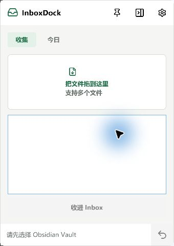

# InboxDock


InboxDock 是一个 Windows 桌面材料桶。即使 Obsidian 完全退出，也可以把文件、文字和网址收进 Vault Inbox，或快速追加到今天的 Daily。



## 功能

- 桌面悬浮窗口与系统托盘
- 拖放一个或多个文件
- 快速收集文字和网址
- 按完成、学习、问题、灵感追加 Daily
- 撤销本次运行中的上一次操作
- 中文目录和文件名支持
- 本地运行，无账号、无遥测、无网络请求

## 安装和使用

1. 从 GitHub Releases 下载 `InboxDock-win-x64.zip` 并解压到固定目录。
2. 运行 `InboxDock.exe`。
3. 点击右上角设置图标，选择包含 `.obsidian` 的 Vault 根目录。
4. 将文件拖入“收集”，或输入文字后点击“收进 Inbox”。
5. 在“今日”中选择类型并追加到 Daily。

关闭窗口只会隐藏到托盘。右键托盘图标可以完全退出。

## 默认写入位置

所选 Vault 内：

- Inbox：`00 Inbox收件箱`
- Daily：`01 Daily日常/YYYY-MM-DD.md`
- Daily 模板：`10 Knowledge Hub/Templates/Daily.md`
- 附件：`05 Resources/Attachments/YYYY-MM-DD`

设置保存到 `%LocalAppData%\InboxDock\settings.json`。InboxDock 不会上传内容，也不会直接调用 Codex；进入 Vault 后可继续用 Claudian/Codex 整理。

## 开发

需要 Windows 和 .NET 10 SDK。

```powershell
dotnet restore InboxDock.sln
dotnet build InboxDock.sln
dotnet test InboxDock.sln
dotnet run --project src/InboxDock.App
```

发布便携版：

```powershell
dotnet publish src/InboxDock.App -c Release -r win-x64 --self-contained true -o artifacts/publish
Compress-Archive artifacts/publish/* artifacts/InboxDock-win-x64.zip
```

## 隐私和安全

- 原始拖入文件不会被移动或删除。
- 目标重名时自动增加编号，不覆盖已有文件。
- 新笔记先写临时文件，再提交到目标路径。
- Daily 使用隐藏的 capture ID 精确撤销单条记录。
- Vault 相对路径必须保持在 Vault 根目录内。

## License

MIT
